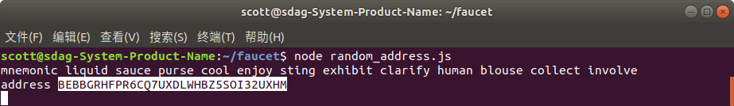
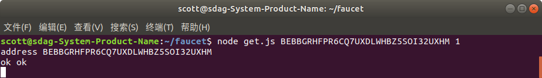
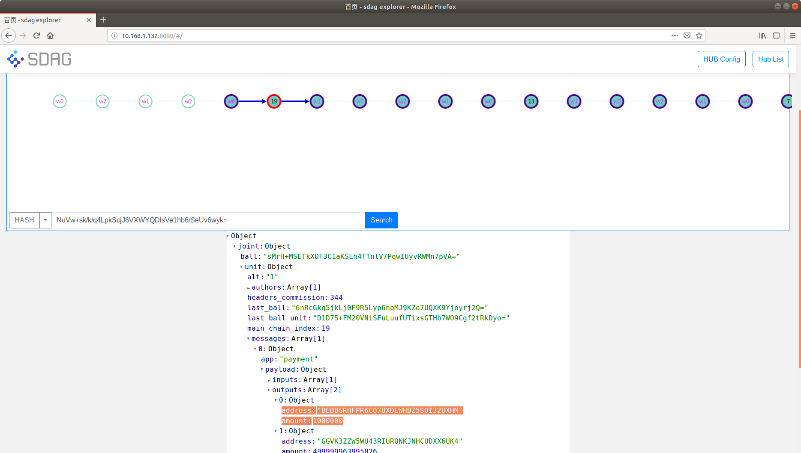

# faucet 水龙头

> faucet for SDAG testnet

首先克隆并安装安装水龙头

```
git clone https://github.com/smart-dag/faucet.git
cd faucet
npm install
```

之后启动docker。猛击此处查看如何启动docker。https://github.com/smart-dag/docs/blob/master/GettingStarted/README_CN.md

在faucet目录中，配置hub地址：

```
nano config.js
```

内容如下：

```
const hub = "127.0.0.1:6615";
const mnemonic = "fade aunt crack express uncle fit valley faculty candy toddler buzz pink";
exports.hub = hub;
exports.mnemonic = mnemonic;
```

mnemonic的fade aunt crack express uncle fit valley faculty candy toddler buzz pink是怎么来的呢？在docker里输入一个命令获得的：

```
docker exec -it sdag cat data/sdg/settings.json
```

因为目前我们提供的docker，创世都一样。所以水龙头的 mnemonic 都是 fade aunt crack express uncle fit valley faculty candy toddler buzz pink 。

然后随便生成一个地址：

```
node random_address.js
```



记住这个地址，然后输入：

```
node get.js BEBBGRHFPR6CQ7UXDLWHBZ5SOI32UXHM 1
```



这样就从基金会给地址 BEBBGRHFPR6CQ7UXDLWHBZ5SOI32UXHM 发送了1个单位的数字资产。

在explorer中，可以找到这条转账记录。



> 注意：1个单位的数字资产对应10^6。

自此，命令行版本的水龙头就已经结束了。

也可以使用桌面版的wallet，参考这里： https://github.com/smart-dag/docs/blob/master/use-desktop-wallet/README.md 
